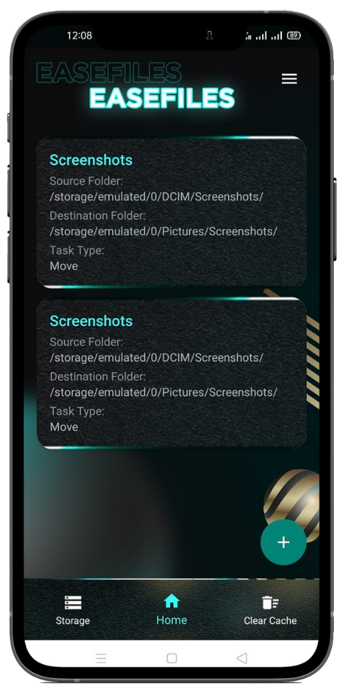
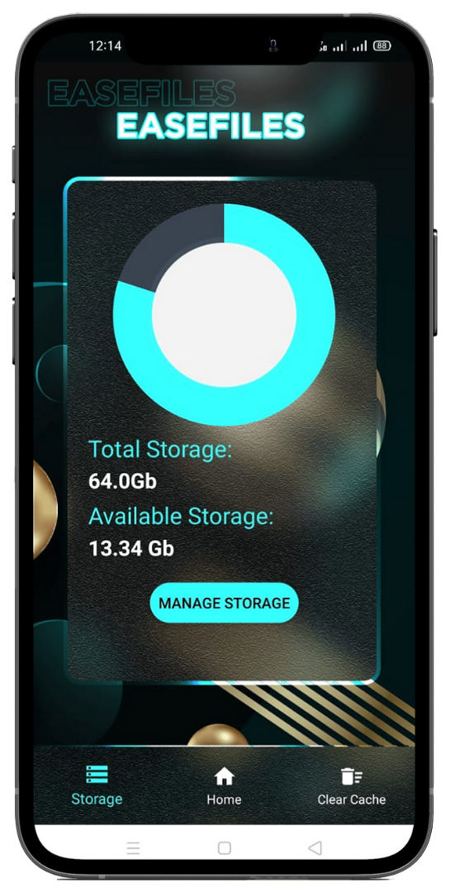
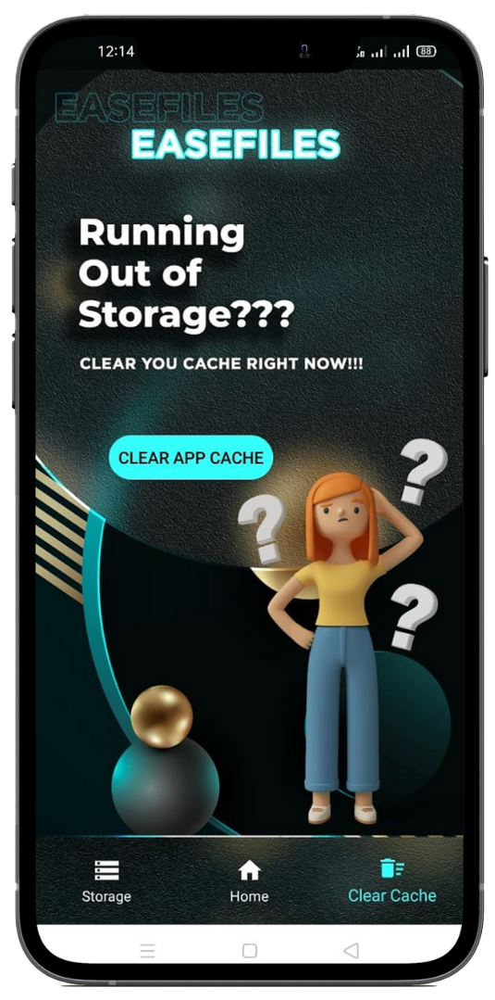

# EaseFiles
Project build for WEBARCH Hackathon (WEB-2.0)

## Theme
Automation

## Theme Description
Build a product that makes everyday life more convenient by taking time 
consuming tasks performed by public and reducing the human intervention in 
the task.
Pick a task, analyze the steps required to complete it and build an interface for 
automation.
Participants can consider college student's day to day task like document sorting
etc.

## Tagline
File Management made easy

## Problem Statement:
<!-- Problem Statement: -->

## Demo
Demo video from [here](paste the link here).

## PPT
[here](https://www.canva.com/design/DAEjCcNqMow/W6KEV9Oh-tbhdCgZPqDo7g/view?utm_content=DAEjCcNqMow&utm_campaign=designshare&utm_medium=link&utm_source=sharebutton)

## What it does

## How we built it
- Android studio
- Eazegraph
- Canva
- Adobe XD

## Challenges we ran into

## What we learned

## Future Updates
- Cloud storage
- Sharing Files Through NFC
- Folder Protection

## Some glimpse of the site

 

 

